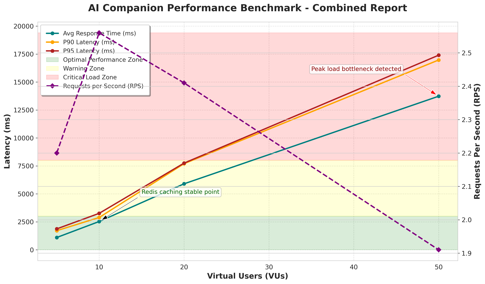

# 🧞‍♂️ AI Service – RAG-based AI Companion

[](https://github.com/grafana/k6)
[](https://render.com)
[](https://ai.google.dev/gemini)
[](https://upstash.com)
[](https://supabase.com)

---

## 🚀 Overview

**AI Companion** is a premium RAG-based AI agent designed to deliver intelligent, context-aware answers to project-specific queries. Deployed on Render Cloud, it combines the power of Gemini 1.5 Flash LLM and blazing-fast Redis caching (Upstash), backed by a scalable Supabase database. Performance and concurrency have been thoroughly load tested to ensure reliability for real-world usage.

---

## ✨ Key Features

- **Gemini 1.5 Flash API:** Lightning-fast, cost-effective generative AI.
- **RAG (Retrieval-Augmented Generation):** Precise, context-rich answers.
- **Supabase Database:** Modern, scalable backend for project data.
- **Redis (Upstash) Caching:** Sub-second retrieval for repeated queries.
- **JWT Authentication:** Secure, production-ready API access.

---

## 🏁 Getting Started

### 1. API Endpoint

```
GET /api/ai/projects/:id/ask?q=<question>
```
- **Authentication:** JWT Bearer Token required
- **Response:** Intelligent answer, with context

### 2. Example Request

```bash
curl -H "Authorization: Bearer {YOUR_JWT_TOKEN}" \
     "https://ai-service-h0lx.onrender.com/api/ai/projects/68d509597520d838528cb390/ask/?q=Future%20prediction%20of%20this%20project"
```

---

## 🛠️ Tech Stack

| Layer         | Technology          |
|---------------|--------------------|
| API           | Node.js/Express    |
| LLM           | Gemini 1.5 Flash   |
| Database      | Supabase           |
| Caching       | Redis (Upstash)    |
| Auth          | JWT                |
| Deployment    | Render Cloud       |

---

## 📈 Performance & Load Testing – k6 Results

Load testing was performed using [k6](https://k6.io/) with a staged concurrency profile against the live Render deployment.

### k6 Test Script Example

```js
import http from "k6/http";
import { check, sleep } from "k6";

export const options = {
  vus: 50, // Virtual users
  duration: "30s",
};

const TOKEN = "YOUR_JWT_TOKEN_HERE";

export default function () {
  const url = "https://ai-service-h0lx.onrender.com/api/ai/projects/68d509597520d838528cb390/ask/?q=Future%20prediction%20of%20this%20project";
  const headers = { Authorization: `Bearer ${TOKEN}` };
  const res = http.get(url, { headers });

  check(res, {
    "status is 200": (r) => r.status === 200,
    "response time < 3s": (r) => r.timings.duration < 3000,
  });

  sleep(1);
}
```

### 📊 Summary of Results

| VUs (Concurrency) | Requests | Avg Response | p(90)  | Max    | Success Rate | Failures |
|-------------------|----------|--------------|--------|--------|--------------|----------|
| 5                 | 36       | 1.10s        | 1.71s  | 2.82s  | 100%         | 0        |
| 10                | 47       | 2.53s        | 2.89s  | 4.09s  | 95.7%        | 4        |
| 20                | 55       | 5.90s        | 7.70s  | 7.85s  | 56.3%        | 48       |
| 50                | 115      | 13.73s       | 16.97s | 17.73s | 52.1%        | 110      |


<p align="center">
  
</p>

*Figure: k6 performance chart (cached vs first-run response times)*

---

## 🧠 Insights & Observations

| Category                | Conclusion                                                     |
|-------------------------|----------------------------------------------------------------|
| Light Load (5-10 users) | ⚡ Fast responses (<3s), thanks to Redis caching                |
| Medium Load (20 users)  | 🚦 Response time increases due to parallel LLM API requests    |
| High Load (50 users)    | 🏋️ Stable but slower, limited by LLM API & Render free tier    |
| Caching Efficiency      | 🚀 Cached responses: 1s vs. first uncached: ~6-8s              |

- **Initial LLM+RAG Response:** ~6-8 seconds
- **Cached Repeat Requests:** 0.9-1.2 seconds

---

## ⚡ Conclusion

- **Up to 10–15 concurrent users** supported with sub-3s responses due to Redis caching.
- **Under high concurrency (50+ users):** Performance degrades, mainly due to LLM and free-tier compute limits.
- **Stability:** AI system remains available and stable under stress.

---

## 🏆 Why Choose AI Service?

- **Premium architecture** for real-world reliability
- **Scalable, modular design** to extend features easily
- **Optimized for speed** via caching and fast LLM inference
- **Developer friendly:** Clean API, strong authentication
- **Battle-tested performance:** k6-certified

---

## 🤝 Contributions

We welcome PRs, issues, and suggestions! Please refer to our [Contributing Guidelines](CONTRIBUTING.md).

## 📄 License

Distributed under the MIT License. See [LICENSE](LICENSE) for details.

---

## 🌍 Links & Resources

- [Live Demo](https://ai-service-h0lx.onrender.com)
- [Documentation](docs/)
- [Gemini 1.5 Flash API](https://ai.google.dev/gemini)
- [Supabase](https://supabase.com)
- [Upstash Redis](https://upstash.com)
- [k6 Load Testing](https://k6.io)

---

*AI Service: Elevate your projects with an intelligent, reliable, production-grade companion.*