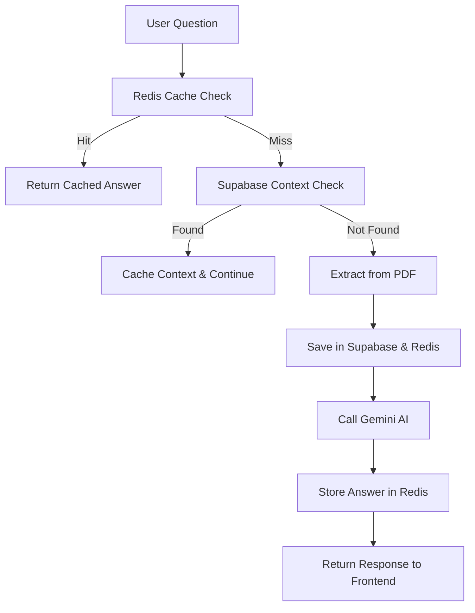

# 🧠 AI Academic Project Companion

A production-grade platform leveraging state-of-the-art AI to parse, summarize, and interact with academic projects—built for scalable, real-time educational workflows.

---

## 🧰 Tech Stack

| Component             | Technology                                    |
|-----------------------|-----------------------------------------------|
| **AI Model**          | Google Gemini 2.5 Flash                       |
| **Backend**           | Django REST Framework                         |
| **Frontend**          | React · Vite · Tailwind CSS                   |
| **AI Cache Layer**    | Redis (Upstash)                               |
| **Database/Storage**  | Supabase PostgreSQL                           |
| **PDF Parsing**       | PyMuPDF                                       |
| **Deployment**        | Docker · Render                               |
| **Version Control**   | GitHub                                        |

---

## 📡 API Usage Example

### 🔍 Querying the AI (GET)

**Endpoint:**  
```
GET /api/ai/projects/<project_id>/ask?q=<your_question>
```

**Response Example:**
```json
{
  "project_title": "Unified Academic Projects Portal",
  "question": "what is project summary?",
  "answer": "The Unified Academic Project Portal (UAPP) is a centralized web-based platform..."
}
```

---

## 🗄 Required Environment Variables (`.env`)

```env
SUPABASE_URL=your_supabase_url
SUPABASE_KEY=your_supabase_key
GOOGLE_API_KEY=your_gemini_key
REDIS_URL=your_upstash_redis_url
REDIS_TOKEN=your_upstash_redis_token
```

---

## 🐳 Docker-Based Deployment

**To Build:**
```sh
docker build -t ai-companion .
```

**To Run:**
```sh
docker run -p 8000:8000 ai-companion
```

**API is available at:**  
`http://localhost:8000`

---

## 🧠 Redis AI Caching Strategy

| Key Format                   | TTL  | Description                                 |
|------------------------------|------|---------------------------------------------|
| `project_context:<id>`       | 24h  | PDF text extracted & cached for fast reuse  |
| `ai_answer:<id>:<question>`  | 30m  | Cached AI responses for lightning replies    |

**Example Key:**  
`ai_answer:68ecb1…:what is summary?` → Returns answer in milliseconds

**Typical Logging Output:**
- 📌 `Redis MISS - Extracting PDF`
- 📦 `Supabase saved`
- 💾 `Redis Save 24h context`
- 🤖 `Redis HIT - Returning cached answer`

---

## 🧪 API Testing (Postman Example)

```
http://localhost:8000/api/ai/projects/68d509597520d838528cb390/ask?q=what is project summary?
```

**Expected Output:**  
🤖 `Redis HIT - Answer from cache`

---

## 🏗 Architecture Flow



---

## 🔮 Roadmap & Upcoming Features

| Feature                     | Description                                         |
|-----------------------------|-----------------------------------------------------|
| 🎙 Voice-based interaction  | Ask questions via microphone                        |
| 📎 Chat with full documents | Keep chat history across multiple PDFs              |
| 🧪 AI evaluator mode        | Automated grading for project scorecards            |
| 🌐 Multi-agent system       | Agents for research, evaluation & assistant roles   |
| 📈 Streaming responses      | Real-time, token-based response streaming           |

---

## 👨‍💻 Author & Maintainer

**Hemant Gowaedipe**  
Bachelor of Engineering (CSE) · Nagpur, India  
Driven by a passion for AI, full-stack development & scalable systems.

📧 Contact: hemantgowardipe442@gmail.com 
🔗 [LinkedIn](https://www.linkedin.com/in/hemant-gowardipe-96614b24a/)  

---

## 🪪 License

Distributed under the [MIT License](LICENSE).

---

## ⭐ Contributing

If you find this project useful, please ⭐️ star the repo and contribute!  
We welcome suggestions, improvements, and pull requests.

---