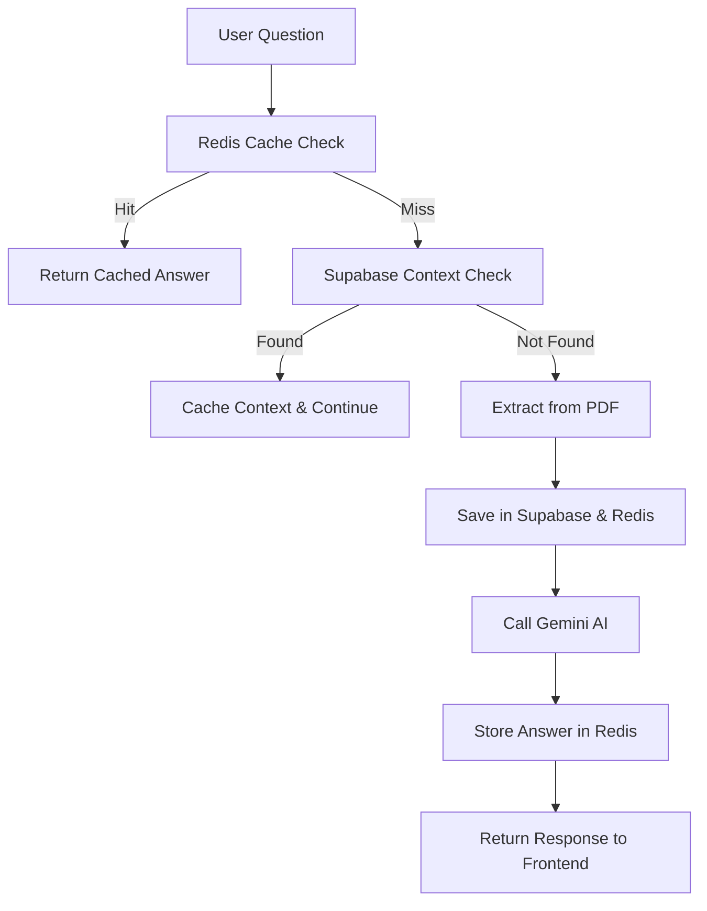

# 🧠 AI Academic Project Companion

[](https://github.com/grafana/k6)
[](https://render.com)
[](https://ai.google.dev/gemini)
[](https://upstash.com)
[](https://supabase.com)

A production-grade platform leveraging state-of-the-art AI to parse, summarize, and interact with academic projects—built for scalable, real-time educational workflows.

---

## 🧰 Tech Stack

| Component             | Technology                                    |
|-----------------------|-----------------------------------------------|
| **AI Model**          | Google Gemini 2.5 Flash                       |
| **Backend**           | Django REST Framework                         |
| **Frontend**          | React · Vite · Tailwind CSS                   |
| **AI Cache Layer**    | Redis (Upstash)                               |
| **Database/Storage**  | Supabase PostgreSQL                           |
| **PDF Parsing**       | PyMuPDF                                       |
| **Deployment**        | Docker · Render                               |
| **Version Control**   | GitHub                                        |

---

## 📡 API Usage Example

### 🔍 Querying the AI (GET)

**Endpoint:**  
```
GET /api/ai/projects/<project_id>/ask?q=<your_question>
```

**Response Example:**
```json
{
  "project_title": "Unified Academic Projects Portal",
  "question": "what is project summary?",
  "answer": "The Unified Academic Project Portal (UAPP) is a centralized web-based platform..."
}
```

---

## 🗄 Required Environment Variables (`.env`)

```env
SUPABASE_URL=your_supabase_url
SUPABASE_KEY=your_supabase_key
GOOGLE_API_KEY=your_gemini_key
REDIS_URL=your_upstash_redis_url
REDIS_TOKEN=your_upstash_redis_token
```

---

## 🐳 Docker-Based Deployment

**To Build:**
```sh
docker build -t ai-companion .
```

**To Run:**
```sh
docker run -p 8000:8000 ai-companion
```

**API is available at:**  
`http://localhost:8000`

---

## 📈 Performance & Load Testing – k6 Results

Load testing was performed using [k6](https://k6.io/) with a staged concurrency profile against the live Render deployment.

### k6 Test Script Example

```js
import http from "k6/http";
import { check, sleep } from "k6";

export const options = {
  vus: 50, // Virtual users
  duration: "30s",
};

const TOKEN = "YOUR_JWT_TOKEN_HERE";

export default function () {
  const url = "https://ai-service-h0lx.onrender.com/api/ai/projects/68d509597520d838528cb390/ask/?q=Future%20prediction%20of%20this%20project";
  const headers = { Authorization: `Bearer ${TOKEN}` };
  const res = http.get(url, { headers });

  check(res, {
    "status is 200": (r) => r.status === 200,
    "response time < 3s": (r) => r.timings.duration < 3000,
  });

  sleep(1);
}
```

### 📊 Summary of Results

| VUs (Concurrency) | Requests | Avg Response | p(90)  | Max    | Success Rate | Failures |
|-------------------|----------|--------------|--------|--------|--------------|----------|
| 5                 | 36       | 1.10s        | 1.71s  | 2.82s  | 100%         | 0        |
| 10                | 47       | 2.53s        | 2.89s  | 4.09s  | 95.7%        | 4        |
| 20                | 55       | 5.90s        | 7.70s  | 7.85s  | 56.3%        | 48       |
| 50                | 115      | 13.73s       | 16.97s | 17.73s | 52.1%        | 110      |

---

## 🧠 Insights & Observations

| Category                | Conclusion                                                     |
|-------------------------|----------------------------------------------------------------|
| Light Load (5-10 users) | ⚡ Fast responses (<3s), thanks to Redis caching                |
| Medium Load (20 users)  | 🚦 Response time increases due to parallel LLM API requests    |
| High Load (50 users)    | 🏋️ Stable but slower, limited by LLM API & Render free tier    |
| Caching Efficiency      | 🚀 Cached responses: 1s vs. first uncached: ~6-8s              |

- **Initial LLM+RAG Response:** ~6-8 seconds
- **Cached Repeat Requests:** 0.9-1.2 seconds

---

## ⚡ Conclusion

- **Up to 10–15 concurrent users** supported with sub-3s responses due to Redis caching.
- **Under high concurrency (50+ users):** Performance degrades, mainly due to LLM and free-tier compute limits.
- **Stability:** AI system remains available and stable under stress.

---

## 🧠 Redis AI Caching Strategy

| Key Format                   | TTL  | Description                                 |
|------------------------------|------|---------------------------------------------|
| `project_context:<id>`       | 24h  | PDF text extracted & cached for fast reuse  |
| `ai_answer:<id>:<question>`  | 30m  | Cached AI responses for lightning replies    |

**Example Key:**  
`ai_answer:68ecb1…:what is summary?` → Returns answer in milliseconds

**Typical Logging Output:**
- 📌 `Redis MISS - Extracting PDF`
- 📦 `Supabase saved`
- 💾 `Redis Save 24h context`
- 🤖 `Redis HIT - Returning cached answer`

---

## 🧪 API Testing (Postman Example)

```
http://localhost:8000/api/ai/projects/68d509597520d838528cb390/ask?q=what is project summary?
```

**Expected Output:**  
🤖 `Redis HIT - Answer from cache`

---

## 🏗 Architecture Flow



---

## 🔮 Roadmap & Upcoming Features

| Feature                     | Description                                         |
|-----------------------------|-----------------------------------------------------|
| 🎙 Voice-based interaction  | Ask questions via microphone                        |
| 📎 Chat with full documents | Keep chat history across multiple PDFs              |
| 🧪 AI evaluator mode        | Automated grading for project scorecards            |
| 🌐 Multi-agent system       | Agents for research, evaluation & assistant roles   |
| 📈 Streaming responses      | Real-time, token-based response streaming           |

---

## 👨‍💻 Author & Maintainer

**Hemant Gowaedipe**  
Bachelor of Engineering (CSE) · Nagpur, India  
Driven by a passion for AI, full-stack development & scalable systems.

📧 Contact: hemantgowardipe442@gmail.com 
🔗 [LinkedIn](https://www.linkedin.com/in/hemant-gowardipe-96614b24a/)  

---

## 🪪 License

Distributed under the [MIT License](LICENSE).

---

## ⭐ Contributing

If you find this project useful, please ⭐️ star the repo and contribute!  
We welcome suggestions, improvements, and pull requests.

---